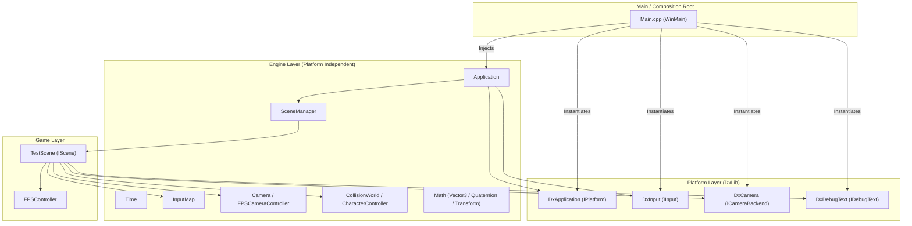

# 3D FPS Game Framework (Final27-Assignment)

DxLib（DirectX 11）をベースに構築された、保守性・拡張性・移植性を重視した **3D ファーストパーソン・シューター（FPS）ゲームフレームワーク** です。

本プロジェクトは、DxLib API を直接ゲームロジックに結びつけるのではなく、**クリーンアーキテクチャ（レイヤードアーキテクチャ）** および **DI（Dependency Injection）** を採用し、プラットフォーム依存処理（DxLib）とコアエンジン・ゲームロジックを完全に分離した設計となっています。

本ドキュメントは、プロジェクトの共同開発者・コラボレーターが現在の実装進捗、アーキテクチャ設計、各モジュールの役割、および今後の開発タスクを正確に把握できるようにまとめたものです。

---

## 目次
1. [技術スタック・動作環境](#技術スタック動作環境)
2. [アーキテクチャ設計思想](#アーキテクチャ設計思想)
3. [ディレクトリ構成](#ディレクトリ構成)
4. [モジュール詳細解説](#モジュール詳細解説)
5. [現在の実装状況・進捗ステータス](#現在の実装状況進捗ステータス)
6. [開発ロードマップ（今後のタスク）](#開発ロードマップ今後のタスク)
7. [ビルドおよび実行方法](#ビルドおよび実行方法)
8. [共同開発ガイドライン・コーディング規約](#共同開発ガイドラインコーディング規約)

---

## 技術スタック・動作環境

| 項目 | 内容 |
| :--- | :--- |
| **開発言語** | C++20 (`/std:c++20`) |
| **開発環境** | Microsoft Visual Studio 2022 (MSVC v143) |
| **対象プラットフォーム** | Windows 10 / 11 (x64 / Win32) |
| **グラフィックス / バックエンド** | DxLib (DirectX 11 版) |
| **ビルドシステム** | Visual Studio Solution (`DxLib.sln`) / MSBuild |

---

## アーキテクチャ設計思想

本フレームワークは以下の 3 つの基本設計原則に基づいて構築されています。



### 1. プラットフォーム抽象化と依存性逆転 (Dependency Inversion Principle)
- `src/Engine/` および `src/Game/` 内のコードは、**DxLib のヘッダー（`DxLib.h`）や独自の型（`VECTOR` など）に一切依存していません**。
- すべてのプラットフォーム機能（ウィンドウライフサイクル、入力取得、カメラ描画適用、デバッグ文字描画）はインターフェース（`IPlatform`, `IInput`, `ICameraBackend`, `IDebugText`）を通して利用します。
- これにより、将来的に描画バックエンドを DirectX 12、Vulkan、または別ライブラリへ差し替えることが容易です。

### 2. 単一責任の原則と Composition Root
- エントリポイントである `src/Main.cpp` が **Composition Root（依存関係の組み立て場所）** として機能します。具象プラットフォームクラスをインスタンス化し、`Application` へ参照を注入（DI）します。
- グローバル変数やシングルトンパターンを排除し、各クラスのライフサイクルと所有権（Ownership）を明確にしています。

### 3. ポータブルな自作数学ライブラリ (Data-Oriented & Portable Math)
- 外部ライブラリに依存しない独自の 3D 数学ライブラリ（`Vector3`, `Quaternion`, `Transform`）を完備。
- クォータニオンによるジンバルロックのない回転計算や、ローカル座標軸（Forward, Right, Up）の動的導出を保証します。

---

## ディレクトリ構成

```
Final27-Assignment/
├── Assets/                      # ゲームリソース配置ディレクトリ
│   ├── Fonts/                   # フォントファイル
│   ├── Maps/                    # マップ・レベルデータ
│   ├── Models/                  # 3Dモデル (.mv1 など)
│   ├── Sounds/                  # サウンド・BGMファイル
│   └── Textures/                # テクスチャ素材
├── deps/                        # 外部ライブラリ
├── src/
│   ├── Engine/                  # プラットフォーム非依存 コアエンジン
│   │   ├── Core/                # アプリケーション基幹 (ループ, タイマー, 基底IF)
│   │   ├── Debug/               # 診断・デバッグ用インターフェース
│   │   ├── Input/               # 入力抽象化, アクションマッピング
│   │   ├── Math/                # 3D数学 (Vector3, Quaternion, Transform)
│   │   ├── Physics/             # 衝突判定 (AABB, CollisionWorld, CharacterController)
│   │   │   ├── Character/       # キャラクター押し出し移動制御
│   │   │   └── Collision/       # AABB交差計算, MTV算出, コライダー管理
│   │   ├── Rendering/           # カメラ抽象化, FPS視点操作コントローラ
│   │   └── Scene/               # シーンマネージャ, 遅延シーン遷移機構
│   ├── Game/                    # ゲームプレイ実装レイヤー
│   │   ├── Player/              # FPSプレイヤー移動ロジック
│   │   └── Scenes/              # 具体的なゲームシーン (TestScene)
│   ├── Platform/
│   │   └── DxLib/               # DxLib を利用した具象プラットフォーム実装
│   └── Main.cpp                 # WinMain エントリポイント (Composition Root)
├── DxLib.sln                    # Visual Studio 2022 ソリューション
├── DxLib.vcxproj                # プロジェクト構成ファイル
└── README.md                    # 本仕様・進捗ドキュメント
```

---

## モジュール詳細解説

### 1. Engine::Core
- **`IPlatform.h`**: ウィンドウ管理、メッセージループ、フレーム開始/終了 (`BeginFrame`/`EndFrame`) の抽象インターフェース。
- **`Application.h / .cpp`**: メインループ管理クラス。`Time::Update()`、プラットフォームイベント処理、Scene の `Update()` / `Render()` を統括。
- **`Time.h / .cpp`**: `std::chrono::steady_clock` を用いた高精度タイマー。フレーム間経過時間 `DeltaTime()` および累積時間 `TotalTime()` を提供。

### 2. Engine::Math
- **`Vector3.h`**: 3次元ベクトル構造体。加減乗除、内積 (`Dot`)、外積 (`Cross`)、正規化 (`Normalize`)、線形補間 (`Lerp`) を完全実装。
- **`Quaternion.h`**: 単位クォータニオン（四元数）。任意軸回転生成 (`FromAxisAngle`)、ハミルトン積 (`operator*`)、共役、ベクトル回転 (`Rotate`) をサポート。
- **`Transform.h`**: 位置 (`Vector3 position`)、姿勢 (`Quaternion rotation`)、スケール (`Vector3 scale`) を保持する基本変換構造体。

### 3. Engine::Input
- **`IInput.h`**: キー入力状態、マウスボタン、マウス移動差分 (`MouseDelta`) を取得するインターフェース。
- **`InputTypes.h`**: プラットフォーム非依存のキーコード (`KeyCode::W`, `Space` 等) およびマウス入力の定義。
- **`InputAction.h`**: 論理アクション列挙型 (`MoveForward`, `MoveBackward`, `MoveLeft`, `MoveRight`)。
- **`InputMap.h / .cpp`**: 物理キー (`KeyCode`) を論理アクション (`InputAction`) にバインドし、長押し (`IsDown`)・押下フレーム (`IsPressed`)・解放フレーム (`IsReleased`) を判定。

### 4. Engine::Rendering
- **`ICameraBackend.h`**: Engine の `Camera` 情報を描画 API に流し込むインターフェース。
- **`Camera.h / .cpp`**: 観測者の位置・姿勢 (`Transform`)、FOV、Near/Far クリップ面を管理。回転クォータニオンから `GetForward()`, `GetRight()`, `GetUp()` をリアルタイム算出。
- **`FPSCameraController.h / .cpp`**: マウス移動差分から Yaw/Pitch を蓄積計算し、カメラのクォータニオンを再構築。垂直回転の反転防止（Pitch 制限: 約 ±89度）、マウス感度、軸反転（InvertX/Y）に対応。

### 5. Engine::Physics
- **`AABB.h`**: 軸平行境界ボックス（Axis-Aligned Bounding Box）。中心・サイズ取得、任意平行移動 (`Translated`)。
- **`Collider.h`**: ワールド AABB を保持するコライダー。
- **`Intersection.h / .cpp`**: 
  - `Intersects()`: AABB 同士の重なり判定。
  - `ComputePenetration()`: 最短の押し出し分離ベクトル（MTV: Minimum Translation Vector）と法線（Normal）、めり込み深さ（Penetration）を計算。
- **`CollisionWorld.h / .cpp`**: 登録されたコライダー群の管理および交差・めり込み計算（非所有ポインタ参照）。
- **`CharacterController.h / .cpp`**: 移動ベクトルを加算後、`CollisionWorld` から得られた MTV を用いてコライダーおよび Transform を押し出し補正。壁のすり抜けを防止。

### 6. Engine::Scene
- **`IScene.h`**: シーンのライフサイクル基底クラス（`OnEnter()`, `OnExit()`, `Update()`, `Render()`）。
- **`SceneManager.h / .cpp`**: `std::unique_ptr` によるシーンの安全な所有権管理。コールバック実行中の自己破棄を防ぐため、遅延シーン切り替え（`RequestChange()` → フレーム開始時に `ApplyPendingChange()`）を採用。

### 7. Platform::DxLib
- **`DxApplication.h / .cpp`**: ウィンドウモード初期化、`ProcessMessage()` による Windows メッセージ処理、ダブルバッファリング (`ScreenFlip`)。
- **`DxInput.h / .cpp`**: `CheckHitKey()` や `GetMousePoint()` からキー・マウス状態を更新。カーソル初期化時の誤移動防止ガード付き。
- **`DxCamera.h / .cpp`**: Engine の `Camera` 状態を DxLib の `SetCameraPositionAndTargetAndUpVec()`, `SetupCamera_Perspective()`, `SetCameraNearFar()` へ伝達。
- **`DxDebugText.h / .cpp`**: `DrawString()` を用いたスクリーンデバッグ文字描画。

### 8. Game Layer
- **`FPSController.h / .cpp`**: カメラの Forward ベクトルを水平 XZ 平面に射影し、WASD 入力に応じた移動ベクトルを合成・正規化（斜め移動が速くならない処理）。
- **`TestScene.h / .cpp`**: 現在動作しているテスト用シーン。
  - プレイヤー Transform & Collider の初期化
  - 障害物 AABB の配置と `CollisionWorld` への登録
  - 移動と MTV 壁押し出しの動作検証
  - 3D グリッド描画、AABB ワイヤーフレーム描画（非衝突時: シアン / 衝突時: 赤）
  - デバッグ情報（FPS、DeltaTime、座標、衝突状態、法線、めり込み深さ）のリアルタイム表示

---

## 現在の実装状況・進捗ステータス

現在、**「コアエンジンの設計・抽象化」および「FPS プレイヤーの基本移動・視点操作・AABB 衝突応答」が完了**しており、基盤として非常に安定した状態です。

| 機能カテゴリ | 実装項目 | 進捗状況 | 備考 |
| :--- | :--- | :---: | :--- |
| **基盤アーキテクチャ** | プラットフォーム抽象化 (IPlatform, IInput, etc.) | ✅ 完了 | DI パターンによる完全疎結合化 |
| | メインループ & 高精度タイマー (Time) | ✅ 完了 | 可変デルタタイム対応 |
| | シーン管理 (SceneManager) | ✅ 完了 | 遅延遷移による安全なライフサイクル管理 |
| **数学 (Math)** | Vector3 (四則演算, 内積, 外積, 正規化, Lerp) | ✅ 完了 | 独自実装 (DxLib 非依存) |
| | Quaternion (任意軸回転, 積, ベクトル回転) | ✅ 完了 | ジンバルロック回避 |
| | Transform (位置, 姿勢, スケール) | ✅ 完了 | クォータニオン姿勢 |
| **入力 (Input)** | 物理入力取得 (キーボード / マウス / Delta) | ✅ 完了 | DxInput にて実装 |
| | アクションマッピング (InputMap) | ✅ 完了 | キーバインドと論理アクションの分離 |
| **レンダリング** | カメラ抽象化 (Camera) | ✅ 完了 | FOV, Near/Far, 動的基底ベクトル導出 |
| | DxLib カメラバックエンド (DxCamera) | ✅ 完了 | 透視投影設定 |
| | デバッグテキスト描画 (DxDebugText) | ✅ 完了 | スクリーン座標への診断情報出力 |
| | 3D モデル描画・シェーダー | 🚧 未着手 | 現在はプリミティブ・線画のみ |
| **物理・衝突判定** | AABB 交差判定 & 内外判定 | ✅ 完了 | 高速な境界ボックステスト |
| | MTV (最小分離ベクトル) ペネトレーション計算 | ✅ 完了 | 最短軸方向の法線・めり込み量算出 |
| | 衝突ワールド管理 (CollisionWorld) | ✅ 完了 | コライダーの登録・一括交差クエリ |
| | キャラクターコントローラ (押し出し移動) | ✅ 完了 | 壁抜け防止の移動補正 |
| | 重力・接地判定・ジャンプ | 🚧 未着手 | 現状は XZ 水平移動のみ |
| **ゲームプレイ** | FPS 視点操作 (FPSCameraController) | ✅ 完了 | マウス追従, Pitch 制限 (±89°) |
| | FPS プレイヤー移動 (FPSController) | ✅ 完了 | 水平射影, 斜め移動速度の正規化 |
| | 武器・射撃メカニクス | 🚧 未着手 | レイキャスト / 弾丸処理 |
| | エネミー AI | 🚧 未着手 | - |
| | サウンド再生 | 🚧 未着手 | - |

---
---

## ビルドおよび実行方法

### 必要環境
- Windows 10 / 11
- Visual Studio 2022（「C++ によるデスクトップ開発」ワークロード必須）
- DxLib（プロジェクト直下の `DxLib/` に x64 ライブラリが配置済み）

### 1. Visual Studio を使用する場合
1. ルートディレクトリの `DxLib.sln` を Visual Studio 2022 で開きます。
2. ツールバーの構成を **`Debug`** または **`Release`**、プラットフォームを **`x64`** に設定します。
3. `F5` キー（デバッグ開始）または `Ctrl + F5`（デバッグなしで開始）を押下してビルド・実行します。

### 2. コマンドライン（MSBuild）を使用する場合
PowerShell で以下のコマンドを実行します:
```powershell
# x64 Debug ビルド
& "C:\Program Files\Microsoft Visual Studio\2022\Community\MSBuild\Current\Bin\MSBuild.exe" DxLib.sln /p:Configuration=Debug /p:Platform=x64 -m

# 実行
.\x64\Debug\DxLib.exe
```

### 操作方法（TestScene）
| 操作 | アクション |
| :--- | :--- |
| **マウス移動** | 視点回転（Pitch / Yaw） |
| **W / A / S / D** | 前後左右移動（カメラ向きに追従） |
| **ウィンドウ [X] ボタン** | アプリケーション終了 |

---

## 共同開発ガイドライン・コーディング規約

共同開発にあたり、本フレームワークの設計原則を維持するため以下のルールを遵守してください。

1. **プラットフォーム抽象化を崩さない**:
   - `src/Engine/` および `src/Game/` のコード内で **`#include <DxLib.h>` を直接インクルードしない** でください。
   - プラットフォーム固有の機能が必要になった場合は、まず `Engine` レイヤーに対応するインターフェース（例: `IAudioBackend`, `IRenderBackend` 等）を定義し、`src/Platform/DxLib/` に実装してください。
2. **所有権とメモリ管理の明確化**:
   - 生ポインタ (`raw pointer`) は**「非所有の参照」**としてのみ使用します（例: `CollisionHit::other` や `IPlatform&`）。
   - リソースの所有権を持つ場合は `std::unique_ptr` または値オブジェクトを使用し、リークを防ぎます。
3. **コメント規約**:
   - 既存コードベースに倣い、設計意図やアーキテクチャ上の判断理由を `// EN:` (英語) および `// JP:` (日本語) のバイリンガル形式、または明確な日本語で記載してください。
4. **数学型の統一**:
   - ベクトルや姿勢の計算には、DxLib の `VECTOR` ではなく `Vector3` や `Quaternion` を使用してください。DxLib 型との相互変換はバックエンド（`DxCamera` 等）内でのみ行います。
