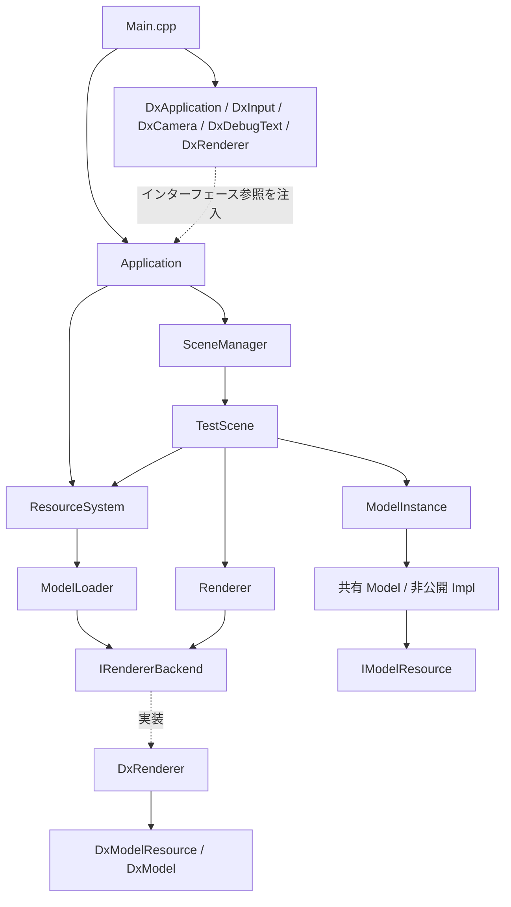

# 3D FPS Game Framework (Final27-Assignment)

DxLib を描画・入力バックエンドとして使用する、Windows 向けの C++20 製 3D FPS フレームワークです。現在は、FPS 視点と水平移動、AABB の押し出し処理、モデルの共有読み込み、インスタンスごとの変換と描画を `TestScene` で組み合わせています。射撃や敵 AI を備えた完成済みのゲームではありません。

この README は現在の `src/` とビルド設定に基づき、実装済みの機能と残っている制約をまとめたものです。

## 目次

1. [技術スタック・動作環境](#技術スタック動作環境)
2. [アーキテクチャと処理の流れ](#アーキテクチャと処理の流れ)
3. [ディレクトリ構成](#ディレクトリ構成)
4. [モジュール詳細](#モジュール詳細)
5. [現在のテストシーンと操作](#現在のテストシーンと操作)
6. [実装状況](#実装状況)
7. [ビルドおよび実行方法](#ビルドおよび実行方法)
8. [テストの現状](#テストの現状)
9. [既知の制約と今後の課題](#既知の制約と今後の課題)
10. [共同開発ガイドライン](#共同開発ガイドライン)

## 技術スタック・動作環境

| 項目 | 内容 |
| :--- | :--- |
| 言語 | C++20。`std::format`、`std::numbers`、`std::filesystem` を使用 |
| 開発環境 | Visual Studio 2022、MSVC v143、Windows SDK |
| 実行環境 | Windows。既存ソリューションでは `Debug / x64` を基本構成とする |
| バックエンド | DxLib。描画 API のバージョンを明示的に選択する処理は現在のソースにはない |
| ビルド | `DxLib.sln` / MSBuild、または CMake 3.20 以降 |
| 外部依存 | DxLib VC 用パッケージを別途配置し、ヘッダー・ライブラリ検索パスを設定 |

既存の `.vcxproj` には Release / Win32 構成もありますが、インクルードパスと C++20 設定は Debug / x64 と統一されていません。詳細はビルド手順を参照してください。

## アーキテクチャと処理の流れ

プラットフォーム機能をインターフェースで受け渡す構成です。`Main.cpp` が DxLib 実装を生成し、`Application` へ参照を注入します。`Application` は `SceneManager` と `ResourceSystem` を所有し、初期シーンとして `TestScene` を生成します。



### 分離されている部分と例外

- ウィンドウとフレーム処理は `IPlatform`、入力は `IInput`、カメラ設定は `ICameraBackend`、文字描画は `IDebugText` を介します。
- モデル生成と描画は `IRendererBackend` を介し、`Model` の公開ヘッダーは DxLib 型を公開しません。現在の `Model.cpp` も DxLib の具象クラスに依存しません。
- 一方、`TestScene.cpp` のグリッドと AABB のデバッグ描画は `DxLib.h` と `DrawLine3D` を直接使用しています。Game 層のプラットフォーム分離はまだ途中です。
- `Application.cpp` は `TestScene` を直接生成するため、Engine のアプリケーション部分には Game 層への依存が残ります。
- `Time` は静的メンバーとファイル内の時計状態を使用します。すべての状態が DI 化されているわけではありません。

### フレームと終了処理

1. プラットフォームを初期化し、初期シーンへの遷移を予約します。
2. メインループでイベント処理、`Time::Update()`、入力更新を行います。
3. `SceneManager::ApplyPendingChange()` で予約済み遷移を適用し、シーンを更新します。
4. `BeginFrame()` → シーン描画 → `EndFrame()` の順で描画します。
5. 終了時はシーンの `OnExit()` と破棄、リソースキャッシュのクリア、プラットフォーム終了の順に処理します。

DxLib のハンドルを持つリソースは、`DxLib_End()` より前に解放する必要があります。現在の `TestScene::OnExit()` はモデルの共有参照を解放します。

## ディレクトリ構成

```text
Final27-Assignment/
├── Assets/
│   ├── Fonts/                  # フォント用ディレクトリ
│   ├── Maps/                   # マップ用ディレクトリ
│   ├── Models/                 # Bicycle.mv1、Newspaper.mv1
│   ├── Sounds/                 # サウンド用ディレクトリ
│   ├── Textures/               # テクスチャ素材
│   └── test.png
├── src/
│   ├── Engine/
│   │   ├── Core/               # Application、IPlatform、Time
│   │   ├── Debug/              # IDebugText
│   │   ├── Input/              # IInput、InputMap、キー・アクション定義
│   │   ├── Math/               # Vector3、Quaternion、Matrix4、Transform
│   │   ├── Physics/
│   │   │   ├── Character/      # CharacterController
│   │   │   └── Collision/      # AABB、Collider、CollisionWorld、交差判定
│   │   ├── Rendering/          # Camera、Model、ModelInstance、Renderer など
│   │   ├── Resources/          # ResourceSystem
│   │   └── Scene/              # IScene、SceneManager
│   ├── Game/
│   │   ├── Player/             # FPSController
│   │   └── Scenes/             # TestScene
│   ├── Platform/
│   │   └── DxLib/              # DxLib 各バックエンド、モデルハンドル管理
│   └── Main.cpp                # WinMain、バックエンド生成と注入
├── CMakeLists.txt
├── DxLib.sln
├── DxLib.vcxproj
├── DxLib.vcxproj.filters
├── .gitignore
└── README.md
```

`*Test.cpp` は対応するモジュールと同じディレクトリに置かれています。ルートの `DxLib/` や `x64/` は現在ビルド生成物の配置に使われており、DxLib の配布ライブラリ配置先とは別です。

## モジュール詳細

### Core・Scene

| 型 | 役割 |
| :--- | :--- |
| `Application` | 初期化、メインループ、初期シーン生成、リソース管理、終了順序を統括 |
| `IPlatform` / `DxApplication` | ウィンドウモードで初期化し、イベント処理、画面クリア、裏画面の反映を行う |
| `Time` | `steady_clock` による可変 `DeltaTime` と累積時間。時間幅の上限や固定ステップは未実装 |
| `IScene` | `OnEnter`、`OnExit`、`Update`、`Render` のライフサイクル |
| `SceneManager` | `unique_ptr` でシーンを所有し、予約された遷移を次の更新処理で適用 |

### Math

- `Vector3`：ベクトル演算、長さ、内積、外積、正規化、線形補間。
- `Quaternion`：軸角からの生成、正規化、共役、積、ベクトル回転。`Rotate()` は単位クォータニオンを前提として使用します。
- `Matrix4`：単位行列、平行移動、回転、スケール、行列積、点と方向の変換。
- `Transform`：位置、回転、スケールを持ち、`ToMatrix()` で `T * R * S` を生成します。

座標軸は **+X が右、+Y が上、+Z が前方**、角度はラジアンです。Engine の行列は列ベクトル規約で、点にはスケール → 回転 → 平行移動の順に作用します。`TransformDirection()` は平行移動を適用しません。`DxRenderer` はバックエンドへ渡す際に行列を転置します。`Matrix4{}` はゼロ行列であり、単位行列が必要な場合は `Matrix4::Identity()` を使用します。

### Input・FPS 操作

- `IInput` / `DxInput`：キーとマウスボタンの保持・押下・解放、およびマウス座標の前フレームとの差分を提供します。初回のマウス差分はゼロです。
- `InputMap`：各論理アクションに一つのキーを割り当てます。未割り当ては `KeyCode::None` です。
- `FPSCameraController`：マウス差分から Yaw / Pitch を更新し、Pitch を ±89 度に制限します。感度と軸反転の設定 API があります。差分は既に移動量なので `deltaTime` は掛けません。
- `FPSController`：カメラ前方を XZ 平面へ投影し、正規化した WASD 方向に速度と `deltaTime` を掛けて移動量を返します。既定速度は 3.0 単位/秒です。衝突応答は担当しません。

### Camera・モデル描画

| 型 | 役割 |
| :--- | :--- |
| `Camera` / `DxCamera` | Transform、FOV、Near/Far を保持し、DxLib のカメラへ適用。既定値は FOV 60 度、Near 0.1、Far 1000 |
| `Model` / `Model::Impl` | バックエンドのモデルリソースを `unique_ptr<IModelResource>` で所有。コピー不可、ムーブ可能 |
| `IModelResource` | バックエンド資源の基底型。仮想デストラクターを持つ |
| `ModelLoader` | 注入された `IRendererBackend` で資源を生成し、`unique_ptr<Model>` を返す。静的関数ではない |
| `ModelInstance` | `shared_ptr<Model>` とインスタンス固有の `Transform` を保持 |
| `Renderer` / `IRendererBackend` | インスタンス描画を委譲。バックエンドはモデル資源の生成も担当 |
| `ModelResourceAccess` | 描画側が `Model` 内部の資源を非所有ポインタとして参照するための窓口 |
| `DxModel` | `MV1LoadModel` / `MV1DeleteModel` による RAII。無効ハンドルは -1。コピー不可、ムーブ対応 |
| `DxModelResource` | `DxModel` を所有する `IModelResource` の実装 |
| `DxRenderer` | 資源型を確認し、インスタンスの行列を `MV1SetMatrix` で適用して `MV1DrawModel` を呼ぶ |

`Model::IsValid()` は内部実装と資源ポインタの存在を確認します。DxLib ハンドルの有効性は `DxRenderer::CreateModelResource()` が生成時に確認します。未設定のモデルや対応しない資源型は描画されません。

### Resources・所有権

モデル読み込みの流れは次のとおりです。

```text
ResourceSystem::LoadModel(path)
  → キャッシュ確認
  → ModelLoader::Load(path)
  → IRendererBackend::CreateModelResource(path)
  → DxModelResource / DxModel
  → Model を shared_ptr に変換して返す
```

- キャッシュキーは `lexically_normal().generic_string()` で正規化したパスです。
- 同じキーのモデルがまだ生存していれば、そのモデルを共有します。
- キャッシュ自体は `weak_ptr<Model>` を保持します。最後の `shared_ptr` がなくなると資源は解放され、次回の読み込みで再生成されます。
- `RemoveExpired()` は期限切れエントリーを削除します。現在の通常ループからは呼ばれていません。
- `Clear()` はキャッシュの登録を削除するだけで、外部に残った共有参照を強制解放しません。
- 読み込みは同期処理です。失敗時は `nullptr` を返し、失敗結果はキャッシュしません。

### Physics・Collision

- `AABB` は二点から min/max を整え、サイズ、中心、平行移動を提供します。`Collider` はワールド空間の AABB を保持します。
- `Intersects()` は境界接触も交差として扱います。`Contains()` は点の内外を判定します。
- `ComputePenetration()` は各軸の分離距離から最小の押し出し方向と深さを算出します。
- `CollisionWorld` は非所有のコライダーポインタを登録し、自己衝突と重複登録を除外します。`ComputeCollision()` は登録順で最初の正のめり込みを返し、深さゼロの接触は除外します。
- `CharacterController` は移動後の重なりを最大 4 回押し出します。連続衝突判定ではないため、大きな移動量に対する壁抜け防止は保証しません。

## 現在のテストシーンと操作

`TestScene::OnEnter()` は WASD を割り当て、`Assets/Models/Bicycle.mv1` を読み込みます。モデルは位置 `(0, 0, 5)`、Y 軸回転 90 度、スケール `(0.02, 0.02, 0.02)` で描画されます。

プレイヤーの開始位置は `(0, 0, -5)`、視点は足元から Y 方向に 1.7 の位置です。プレイヤー AABB は更新時に幅・奥行き 0.6、高さ 1.8 に設定されます。二つの固定 AABB が障害物として登録されています。これらはモデルから自動生成されたコライダーではありません。

描画内容はモデル、XZ グリッド、障害物とプレイヤーの AABB、FPS・DeltaTime・座標・衝突情報です。障害物は黄色、プレイヤーは通常シアン、更新後にめり込みが残っている場合は赤になります。画面の `Collision` は押し出し後の状態であり、そのフレーム中に壁へ接触した履歴ではありません。

| 操作 | 動作 |
| :--- | :--- |
| マウス移動 | 視点回転 |
| W / A / S / D | カメラ方向を基準とした水平移動 |
| ウィンドウの閉じるボタン | 終了 |

Space、Shift、Escape、マウスボタンなどの入力取得 API はありますが、現在のシーンにはジャンプ、ダッシュ、Escape 終了、射撃の割り当てはありません。

## 実装状況

| 分野 | 現在の状態 |
| :--- | :--- |
| アプリケーション・シーン | メインループ、遅延遷移、終了処理を実装 |
| 数学 | Vector3、Quaternion、Matrix4、TRS 変換を実装 |
| 入力・カメラ | アクションマッピング、FPS 視点、水平移動を実装 |
| モデル | RAII、共有資源、インスタンス別 Transform、DxLib 描画を実装 |
| リソース | 同期読み込みと弱参照キャッシュを実装 |
| 衝突 | AABB 判定と反復押し出しを実装。連続衝突判定は未実装 |
| 診断表示 | グリッド、AABB、テキストを表示 |
| 未実装の機能 | 重力、接地・ジャンプ、射撃、敵 AI、サウンド再生、独自シェーダー制御、アニメーション制御 |
| テスト | assert ベースのコードあり。通常起動での自動実行は無効 |

## ビルドおよび実行方法

### 必要環境と依存パス

Visual Studio 2022 の「C++ によるデスクトップ開発」、MSVC v143、Windows SDK、DxLib VC 用パッケージが必要です。CMake を使う場合は CMake 3.20 以降も用意してください。

現在の `Debug / x64` と CMake の既定 DxLib パスは次の場所です。

```text
C:/DxLib_VC/プロジェクトに追加すべきファイル_VC用
```

別の場所へ配置した場合、既存 `.vcxproj` ではインクルードとライブラリの両方の検索パスを変更し、CMake では `DXLIB_DIR` を指定します。CMake の指定は既存の `DxLib.vcxproj` には反映されません。

### Visual Studio / MSBuild

1. `DxLib.sln` を開き、`Debug / x64` を選択します。
2. DxLib のヘッダー・ライブラリ検索パスと `$(ProjectDir)src` の包含を確認します。
3. 作業ディレクトリをプロジェクトルートにして、F5 または Ctrl + F5 で起動します。

プロジェクトルートの PowerShell から実行する場合：

```powershell
& "C:\Program Files\Microsoft Visual Studio\2022\Community\MSBuild\Current\Bin\MSBuild.exe" DxLib.sln /p:Configuration=Debug /p:Platform=x64 -m
.\x64\Debug\DxLib.exe
```

Visual Studio のエディションやインストール先に応じて MSBuild のパスを変更してください。

**既存ソリューションの Release / Win32 構成について：** 現在は `deps/include_dxlib` を参照しており、Debug / x64 と同じ `src` 包含パスと C++20 設定がありません。切り替える前に依存パス、言語標準、対象アーキテクチャのライブラリを整える必要があります。

### CMake

以下はプロジェクトルートで実行します。

```powershell
cmake -B build -S . -G "Visual Studio 17 2022" -A x64 -DDXLIB_DIR="C:/DxLib_VC/プロジェクトに追加すべきファイル_VC用"
cmake --build build --config Debug
.\build\Debug\3DFPSGameFramework.exe
```

CMake は `src/` 内の `.cpp` と `.h` を再帰的に収集し、C++20 と MSVC の `/MTd`（Debug）/ `/MT`（その他）を設定します。独立したテストターゲットは定義されていません。

### アセットの解決

モデルのパスは実行ファイルの場所ではなく、**プロセスの作業ディレクトリ**を基準に解決されます。現在は Assets の自動コピー処理がないため、上記のようにプロジェクトルートから起動してください。CMake 生成の Visual Studio プロジェクトには、デバッガーの作業ディレクトリとしてソースルートが設定されています。

## テストの現状

| ファイル | 現在の状態 |
| :--- | :--- |
| `src/Engine/Math/Matrix4Test.cpp` | 単位行列、平行移動、方向変換、スケール、回転、TRS 合成の assert テストを実装。呼び出しは無効 |
| `src/Platform/DxLib/DxModelTest.cpp` | テスト関数は残っているが、検証ブロックはコメントアウト |
| `src/Engine/Rendering/ModelTest.cpp` | 全体がコメントアウト。旧 static `ModelLoader::Load()` 呼び出しが残る |
| `src/Engine/Resources/ResourceSystemTest.cpp` | 全体がコメントアウト。旧 `ResourceSystem` デフォルト構築が残る |

`Application::Run()` のテスト呼び出しはすべてコメントアウトされています。通常起動できることと、これらのテストが実行・成功することは別です。モデル・資源テストを戻す際は、現在の `IRendererBackend&` を受け取る API に合わせて書き直す必要があります。assert は `NDEBUG` が定義された構成では無効になります。

## 既知の制約と今後の課題

以下は現在のソースから確認できる制約です。実装済み機能とは分けて扱います。

1. **プレイヤー AABB の初期化順序**：`OnEnter()` はプレイヤー位置を設定しますが、AABB は設定しません。最初の `Update()` では `Move()` の後に AABB を設定するため、初回の衝突処理は既定のゼロサイズ AABB を使用します。初期位置と形状を移動前に同期させる必要があります。
2. **大きな時間幅でのすり抜け**：移動先だけを判定し、`DeltaTime` の制限もないため、停止復帰や低 FPS 時に障害物を飛び越える可能性があります。移動の分割、固定ステップ、掃引判定などが今後の課題です。
3. **読み込み失敗時の通知**：`TestScene` はモデル読み込み結果を assert で確認しています。資源が見つからないと Debug では停止し、assert 無効時はモデルを描画せず継続します。実行時のログや復旧処理は未実装です。
4. **マウス入力**：現在は座標差分のみを使用し、カーソルの中央戻し・キャプチャ・フォーカス復帰処理はありません。連続した FPS 操作向けの入力処理は今後の課題です。
5. **キャッシュのパス同一性**：正規化は字句処理のみです。相対/絶対パスや大文字小文字など、同じ実ファイルを指す異なる表記が同一キーになるとは限りません。
6. **プラットフォーム分離**：シーン内の直接的な DxLib デバッグ描画と、Application による具体シーンの生成が残っています。
7. **テストと構成の整備**：停止中のテストを新 API へ移行し、独立実行できる形に整理すること、既存ソリューションの各構成を統一することが必要です。

基盤を整えた後の拡張候補は、重力・接地・ジャンプ、モデルに対応した衝突形状、射撃、敵 AI、サウンド、アニメーション制御です。

## 共同開発ガイドライン

- 新しいプラットフォーム依存処理は原則として `Platform/DxLib/` に実装し、Engine 側のインターフェースから利用します。`TestScene` の直接描画は現状の例外として扱います。
- 単独所有には `unique_ptr`、共有モデルには `shared_ptr`、非所有キャッシュには `weak_ptr` を使い分けます。`CollisionWorld` の登録ポインタは非所有なので、破棄前に登録解除またはクリアしてください。
- モデル資源を保持したまま描画プラットフォームを終了しないでください。キャッシュの `Clear()` だけで外部参照が解放されるわけではありません。
- 数学演算は Engine の型を使用し、DxLib 型への変換はバックエンド側にまとめます。列ベクトル、`T * R * S`、ラジアンの規約を維持してください。
- インターフェースを変更した場合は、利用側、テスト、README を合わせて更新します。コメントアウトされたテストは検証済みとして扱いません。
- 設計意図は既存の `EN` / `JP` 形式、または明確な日本語で記述し、古いコメントが現在の処理と矛盾しないようにしてください。
